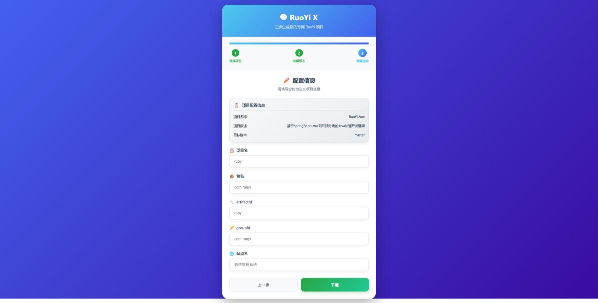

## 项目简介
ruoyi-x 是一个可以在线一键修改RuoYi框架包名、项目名等的工具，代码参考[RuoYi-MT](https://gitee.com/lpf_project/RuoYi-MT)

## 功能说明
* 支持RuoYi、RuoYi-Vue、RuoYi-fast、RuoYi-Cloud 四个项目
* 在线选择版本号或者分支
* 一键修改包名、项目名、配置等
* 支持docker部署

## 页面展示
### 选择项目

### 选择标签

### 选择分支

### 修改项目



## 部署
### 源码部署
```bash
pip install -r requirements.txt
uvicorn app.application:application --host 0.0.0.0 --port 8000
```

### docker部署
```bash
docker run -d --name rouyi-x -p 8000:8000 ghcr.io/bef841ca/rouyi-x
```

### 环境变量配置
- `PROXY_URL`: GitHub API代理地址
- `HOST`: 监听地址
- `PORT`: 监听端口号

### 访问地址
启动后访问: http://localhost:8000